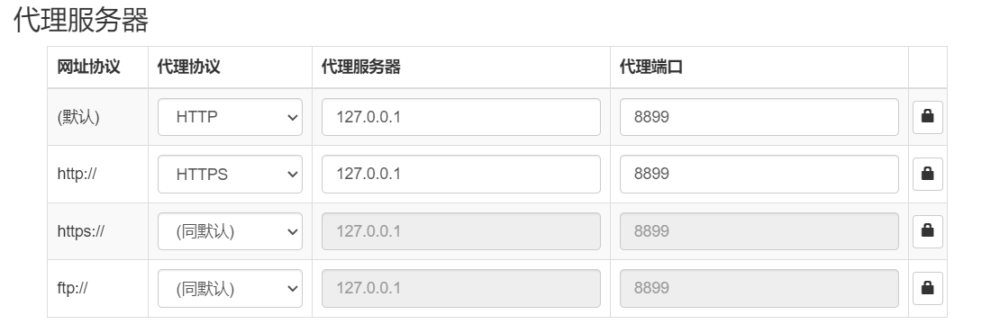
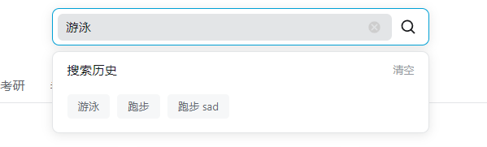

# 哔哩哔哩课程搜索系统

## 项目概述

这是一个基于React和TypeScript开发的课程搜索系统，模仿哔哩哔哩的课程搜索功能。系统提供了课程搜索、分类筛选、排序、历史记录等功能，并支持列表和网格两种视图模式。

## 技术栈

- **前端框架**：React 18
- **开发语言**：TypeScript
- **构建工具**：Vite
- **样式方案**：CSS Modules + Tailwind CSS
- **状态管理**：React Context API
- **数据存储**：localStorage

## 项目结构

```
src/
├── assets/          # 静态资源
├── components/      # 组件
│   ├── SearchBar.tsx       # 搜索栏组件
│   ├── FilterSection.tsx   # 筛选区域组件
│   ├── CourseContent.tsx   # 课程内容组件
│   ├── CourseList.tsx      # 课程列表组件
│   ├── Pagination.tsx      # 分页组件
│   └── DebugPanel.tsx      # 调试面板组件
├── context/
│   └── SearchContext.tsx   # 搜索上下文
├── styles/          # 样式文件
│   ├── SearchBar.css       # 搜索栏样式
│   ├── CategoryNav.css     # 分类导航样式
│   ├── CourseList.css      # 课程列表样式
│   ├── Pagination.css      # 分页样式
│   └── CourseCard.css      # 课程卡片样式
├── util/            # 工具函数
│   └── api.ts       # API接口
├── App.tsx          # 应用入口
└── main.tsx         # 主入口
```

## 运行项目

1. 安装依赖：

```bash
npm install
```

2. 启动开发服务器：

```bash
npm run dev
```

3. 配置`wistle`

   

4. 配置代理

   

## 效果展示
### 1.整体展示（大卡）

### 2.整体展示（小卡）

### 3. 细节展示

1. 搜索框



2. 状态栏切换


3. 排序切换


4. 分页展示


分页细节


5. 列表卡片细节

   

## 核心功能具体实现

### 1. 状态管理设计

#### 1.1 全局状态设计 (SearchContext.tsx)

```typescript
interface SearchContextType {
  keyword: string; // 搜索关键词
  category: string; // 分类ID
  sortType: string; // 排序方式
  viewMode: "grid" | "list"; // 视图模式
  page: number; // 当前页码
  pageSize: number; // 每页数量
  loading: boolean; // 加载状态
  courses: Course[]; // 课程列表
  extraCourses: Course[]; // 推荐课程
  totalPages: number; // 总页数
  searchHistory: string[]; // 搜索历史
  // ... 方法定义
}
```

状态管理特点：

1. 使用 Context API 实现全局状态管理
2. 使用 useRef 保存最新状态，避免闭包问题
3. 实现状态持久化（localStorage）

#### 1.2 状态同步机制

```typescript
// 使用ref保存最新的状态
const pageRef = useRef(page);
const keywordRef = useRef(keyword);
const categoryRef = useRef(category);
const sortTypeRef = useRef(sortType);

// 当状态变化时更新ref
useEffect(() => {
  pageRef.current = page;
  keywordRef.current = keyword;
  categoryRef.current = category;
  sortTypeRef.current = sortType;
}, [page, keyword, category, sortType]);
```

### 2. 搜索功能实现

#### 2.1 API设计

1. **接口定义**

```typescript
// api.ts
interface SearchParams {
  word: string; // 搜索关键词
  classification_id: string; // 分类ID
  sort_type: string; // 排序方式
  page: number; // 页码
  page_size: number; // 每页数量
}

interface SearchResult {
  courses: Course[]; // 课程列表
  extraCourses: Course[]; // 推荐课程
  totalPages: number; // 总页数
}

interface Course {
  id: number; // 课程ID
  title: string; // 课程标题
  brief: string; // 课程简介
  cover: string; // 封面图片
  price: number; // 价格
  originalPrice: number; // 原价
  teacherName: string; // 讲师名称
  teacherAvatar: string; // 讲师头像
  totalTime: string; // 总课时
  studentCount: number; // 学生数量
  chapterCount: number; // 章节数量
  tags: string[]; // 标签
  isExtra: boolean; // 是否为推荐课程
}
```

2. **API实现**

```typescript
// api.ts
export const fetchCourses = async (
  params: SearchParams
): Promise<SearchResult> => {
  try {
    // const response = await fetch('/api/courses', {
    //   method: 'POST',
    //   headers: { 'Content-Type': 'application/json' },
    //   body: JSON.stringify(params)
    // });
    // return await response.json();

    // 模拟API响应
    await new Promise((resolve) => setTimeout(resolve, 500)); // 模拟网络延迟
    const mockMainCourses = mockCourses(15, params.word);
    const mockExtraCourses = mockCourses(12, params.word, true);

    return {
      courses: mockMainCourses,
      extraCourses: mockExtraCourses,
      totalPages: 5,
    };
  } catch (error) {
    console.error("API调用失败:", error);
    throw error;
  }
};
```

#### 2.2 搜索逻辑实现

1. **搜索流程**

```typescript
// SearchContext.tsx
const doSearch = useCallback(
  async (
    searchKeyword: string,
    searchCategory: string,
    searchSortType: string,
    searchPage: number
  ) => {
    setLoading(true);
    try {
      // 1. 构建搜索参数
      const params: SearchParams = {
        word: searchKeyword,
        classification_id: searchCategory,
        sort_type: getSortType(searchSortType),
        page: searchPage,
        page_size: pageSize,
      };

      // 2. 调用API获取数据
      const result: SearchResult = await fetchCourses(params);

      // 3. 更新课程数据
      setCourses(result.courses);
      setExtraCourses(result.extraCourses);

      // 4. 更新总页数
      if (result.totalPages > 0) {
        setTotalPages(result.totalPages);
      }

      // 5. 添加关键词到搜索历史
      if (searchKeyword) {
        addToHistory(searchKeyword);
      }
    } catch (error) {
      // 6. 错误处理：使用模拟数据
      console.error("搜索课程失败:", error);
      const mockMainCourses = mockCourses(15, searchKeyword);
      const mockExtraCourses = mockCourses(12, searchKeyword, true);
      setCourses(mockMainCourses);
      setExtraCourses(mockExtraCourses);
    } finally {
      setLoading(false);
    }
  },
  [pageSize, addToHistory, totalPages]
);
```

2. **搜索触发方式**

```typescript
// 1. 点击搜索按钮
const handleSearch = (e: React.FormEvent) => {
  e.preventDefault();
  if (keyword.trim() === "") return;
  searchWithKeyword(keyword);
  setShowHistory(false);
};

// 2. 点击历史记录
const selectHistory = (item: string) => {
  searchWithKeyword(item);
  setShowHistory(false);
};

// 3. 直接搜索方法
const searchWithKeyword = useCallback(
  async (searchKeyword: string) => {
    setKeyword(searchKeyword);
    setPage(1); // 重置页码
    await doSearch(searchKeyword, categoryRef.current, sortTypeRef.current, 1);
    if (searchKeyword.trim() !== "") {
      addToHistory(searchKeyword);
    }
  },
  [doSearch, addToHistory]
);
```

3. **搜索状态管理**

```typescript
// 1. 状态定义
const [keyword, setKeyword] = useState<string>("跑步");
const [category, setCategory] = useState<string>("-1");
const [sortType, setSortType] = useState<string>("-1");
const [page, setPage] = useState<number>(1);
const [loading, setLoading] = useState<boolean>(false);
const [courses, setCourses] = useState<Course[]>([]);
const [extraCourses, setExtraCourses] = useState<Course[]>([]);
const [totalPages, setTotalPages] = useState<number>(5);

// 2. 状态同步
const pageRef = useRef(page);
const keywordRef = useRef(keyword);
const categoryRef = useRef(category);
const sortTypeRef = useRef(sortType);

useEffect(() => {
  pageRef.current = page;
  keywordRef.current = keyword;
  categoryRef.current = category;
  sortTypeRef.current = sortType;
}, [page, keyword, category, sortType]);
```

4. **错误处理机制**

```typescript
try {
  // 尝试API调用
  const result = await fetchCourses(params);
  // 处理成功响应
} catch (error) {
  // 1. 记录错误
  console.error("搜索课程失败:", error);

  // 2. 使用模拟数据作为备用
  const mockMainCourses = mockCourses(15, searchKeyword);
  const mockExtraCourses = mockCourses(12, searchKeyword, true);

  // 3. 更新UI
  setCourses(mockMainCourses);
  setExtraCourses(mockExtraCourses);

  // 4. 确保有足够的页数
  if (totalPages < 5) {
    setTotalPages(5);
  }
} finally {
  // 5. 无论成功失败都关闭加载状态
  setLoading(false);
}
```

5. **性能优化**

- 使用 `useCallback` 缓存函数
- 使用 `useRef` 保存最新状态
- 使用 `async/await` 处理异步操作
- 实现错误处理和备用数据
- 添加加载状态管理

### 3. 历史记录管理

#### 3.1 存储设计方案

1. **数据存储位置**

   - 浏览器 localStorage：持久化存储
   - React 状态：运行时存储
   - 组件本地状态：UI 展示

2. **数据结构设计**

```typescript
// 历史记录数据结构
type SearchHistory = string[];  // 字符串数组，最多存储10条记录

// 存储格式
{
  "searchHistory": ["关键词1", "关键词2", "关键词3", ...]  // 最多10条
}
```

3. **存储流程**

```typescript
// 1. 初始化加载
const [searchHistory, setSearchHistory] = useState<string[]>(() => {
  const savedHistory = localStorage.getItem("searchHistory");
  return savedHistory ? JSON.parse(savedHistory) : [];
});

// 2. 添加记录
const addToHistory = useCallback((kw: string) => {
  if (kw.trim() === "") return;
  setSearchHistory((prev) => {
    // 去重并将新关键词添加到最前面
    const newHistory = [kw, ...prev.filter((item) => item !== kw)].slice(0, 10);
    localStorage.setItem("searchHistory", JSON.stringify(newHistory));
    return newHistory;
  });
}, []);

// 3. 删除单条记录
const handleRemoveHistoryItem = (e: React.MouseEvent, itemToRemove: string) => {
  e.stopPropagation();
  const savedHistory = localStorage.getItem("searchHistory");
  if (savedHistory) {
    const historyArray = JSON.parse(savedHistory);
    const updatedHistory = historyArray.filter(
      (item: string) => item !== itemToRemove
    );
    localStorage.setItem("searchHistory", JSON.stringify(updatedHistory));
    setLocalSearchHistory(updatedHistory);
  }
};

// 4. 清空所有记录
const clearHistory = useCallback(() => {
  setSearchHistory([]);
  localStorage.removeItem("searchHistory");
}, []);
```

4. **状态同步机制**

```typescript
// 在SearchBar组件中
const [localSearchHistory, setLocalSearchHistory] =
  useState<string[]>(searchHistory);

// 同步外部searchHistory和本地状态
useEffect(() => {
  setLocalSearchHistory(searchHistory);
}, [searchHistory]);
```

5. **性能优化**

   - 使用 `useCallback` 缓存函数
   - 使用 `useEffect` 监听状态变化
   - 使用 `localStorage` 实现持久化
   - 限制历史记录数量为10条

6. **用户体验优化**
   - 新记录添加到最前面
   - 自动去重
   - 点击外部自动关闭
   - 删除单条记录不刷新页面

#### 3.2 添加历史记录

```typescript
const addToHistory = useCallback((kw: string) => {
  if (kw.trim() === "") return;
  setSearchHistory((prev) => {
    // 去重并将新关键词添加到最前面
    const newHistory = [kw, ...prev.filter((item) => item !== kw)].slice(0, 10);
    localStorage.setItem("searchHistory", JSON.stringify(newHistory));
    return newHistory;
  });
}, []);
```

#### 3.3 删除历史记录

```typescript
const handleRemoveHistoryItem = (e: React.MouseEvent, itemToRemove: string) => {
  e.stopPropagation();
  const savedHistory = localStorage.getItem("searchHistory");
  if (savedHistory) {
    const historyArray = JSON.parse(savedHistory);
    const updatedHistory = historyArray.filter(
      (item: string) => item !== itemToRemove
    );
    localStorage.setItem("searchHistory", JSON.stringify(updatedHistory));
    setLocalSearchHistory(updatedHistory);
  }
};
```

#### 3.4 点击历史记录不刷新页面

```typescript
// 在SearchBar.tsx中
const selectHistory = (item: string) => {
  // 使用新方法直接搜索历史记录项
  searchWithKeyword(item);
  // 隐藏历史记录
  setShowHistory(false);
};

// 在SearchContext.tsx中
const searchWithKeyword = useCallback(
  async (searchKeyword: string) => {
    setKeyword(searchKeyword);
    setPage(1); // 重置页码
    await doSearch(searchKeyword, categoryRef.current, sortTypeRef.current, 1);
    if (searchKeyword.trim() !== "") {
      addToHistory(searchKeyword);
    }
  },
  [doSearch, addToHistory]
);
```

实现要点：

1. 使用 `searchWithKeyword` 方法直接执行搜索，避免状态更新延迟
2. 使用 `useRef` 保存最新状态，确保使用最新的状态值
3. 在同一个函数中完成所有操作，避免状态更新竞态
4. 使用 `async/await` 确保操作顺序
5. 更新本地状态而不是刷新页面，提供更流畅的用户体验

### 4. 性能优化

#### 4.1 使用 useCallback 优化函数

```typescript
const searchWithKeyword = useCallback(
  async (searchKeyword: string) => {
    setKeyword(searchKeyword);
    setPage(1);
    await doSearch(searchKeyword, categoryRef.current, sortTypeRef.current, 1);
    if (searchKeyword.trim() !== "") {
      addToHistory(searchKeyword);
    }
  },
  [doSearch, addToHistory]
);
```

#### 4.2 使用 useRef 避免闭包问题

```typescript
const pageRef = useRef(page);
const keywordRef = useRef(keyword);
const categoryRef = useRef(category);
const sortTypeRef = useRef(sortType);
```

### 5. 错误处理

#### 5.1 API 错误处理

```typescript
try {
  const result: SearchResult = await fetchCourses(params);
  // 处理成功响应
} catch (error) {
  console.error("搜索课程失败:", error);
  // 使用模拟数据作为备用
  const mockMainCourses = mockCourses(15, searchKeyword);
  const mockExtraCourses = mockCourses(12, searchKeyword, true);
  setCourses(mockMainCourses);
  setExtraCourses(mockExtraCourses);
}
```

### 6. 用户体验优化

#### 6.1 加载状态处理

```typescript
const [loading, setLoading] = useState<boolean>(false);
// 在搜索过程中显示加载状态
setLoading(true);
try {
  // 执行搜索
} finally {
  setLoading(false);
}
```

#### 6.2 点击外部关闭历史记录

```typescript
useEffect(() => {
  const handleClickOutside = (event: MouseEvent) => {
    if (
      historyRef.current &&
      !historyRef.current.contains(event.target as Node) &&
      inputRef.current &&
      !inputRef.current.contains(event.target as Node)
    ) {
      setShowHistory(false);
    }
  };

  document.addEventListener("mousedown", handleClickOutside);
  return () => {
    document.removeEventListener("mousedown", handleClickOutside);
  };
}, []);
```

### 7. 视图切换设计

#### 7.1 视图模式设计

```typescript
// 1. 视图模式类型定义
type ViewMode = "grid" | "list";

// 2. 视图模式状态
const [viewMode, setViewMode] = useState<ViewMode>("grid");

// 3. 视图切换函数
const setListView = () => {
  setViewMode("list");
};

const setGridView = () => {
  setViewMode("grid");
};
```

#### 7.2 视图切换实现

```typescript
// 1. 视图切换按钮
<div className="view-mode-toggle">
  <button
    className={`view-mode-btn ${viewMode === "list" ? "active" : ""}`}
    onClick={setListView}
    title="列表视图"
  >
    <svg>...</svg>
  </button>
  <button
    className={`view-mode-btn ${viewMode === "grid" ? "active" : ""}`}
    onClick={setGridView}
    title="网格视图"
  >
    <svg>...</svg>
  </button>
</div>

// 2. 视图渲染
<div className={`course-list ${viewMode === 'list' ? 'list-view' : 'grid-view'}`}>
  {courses.map(course => (
    <CourseCard
      key={course.id}
      course={course}
      viewMode={viewMode}
    />
  ))}
</div>
```

#### 7.3 样式设计

```css
/* 1. 网格视图样式 */
.grid-view {
  display: grid;
  grid-template-columns: repeat(auto-fill, minmax(280px, 1fr));
  gap: 20px;
  padding: 20px;
}

/* 2. 列表视图样式 */
.list-view {
  display: flex;
  flex-direction: column;
  gap: 16px;
  padding: 20px;
}

/* 3. 视图切换按钮样式 */
.view-mode-btn {
  display: flex;
  align-items: center;
  justify-content: center;
  width: 14px;
  height: 14px;
  border: 1px solid #fff;
  background-color: #fff;
  color: #9499a0;
  cursor: pointer;
  transition: all 0.2s;
}

.view-mode-btn.active {
  color: #00a1d6;
}
```

#### 7.4 性能优化

1. **条件渲染**

   - 根据视图模式选择不同的布局组件
   - 避免不必要的DOM节点

2. **样式优化**

   - 使用CSS Grid和Flexbox实现响应式布局
   - 使用CSS变量管理主题样式
   - 实现平滑的过渡动画

3. **状态管理**
   - 使用Context API管理视图模式状态
   - 实现视图模式的持久化存储

#### 7.5 用户体验优化

1. **视觉反馈**

   - 当前视图模式按钮高亮显示
   - 添加hover效果
   - 实现平滑的切换动画

2. **交互设计**

   - 提供清晰的视图切换按钮
   - 添加工具提示（title属性）
   - 保持视图切换的即时响应

3. **响应式设计**
   - 网格视图自适应屏幕宽度
   - 列表视图优化移动端显示
   - 确保不同视图模式下的内容可读性

## 部分开发问题及解决方法

1. 部分title中有`html`进行样式包裹

   解决： 使用`react`方法`dangerouslySetInnerHTML`包裹数据

   ~~~ts
   const markup = { __html: course.title };   
   <h3 className="course-title" title={course.title}>
             <div dangerouslySetInnerHTML={markup} />
   </h3>
   ~~~

2. 图片不能成功加载

   ~~~ts
   function processImageUrl(url?: string): string {
     if (!url) return 'https://via.placeholder.com/236x133.png?text=暂无图片';
   
     // 记录原始URL
     console.log('处理前图片URL:', url);
   
     // 移除URL中可能的@前缀参数（B站有时会添加@前缀参数）
     let processedUrl = url.split('@')[0];
   
     // 确保使用HTTPS
     if (processedUrl.startsWith('http:')) {
       processedUrl = processedUrl.replace('http:', 'https:');
     }
   
     // 如果URL不以http开头，添加https前缀
     if (!processedUrl.startsWith('http')) {
       processedUrl = `https:${processedUrl}`;
     }
   
     console.log('处理后图片URL:', processedUrl);
     return processedUrl;
   }
   
   ~~~

   
