# 喜马拉雅听书设计报告

## 文件说明


###  [web](web) 

* [asserts](web\asserts) 
  *  [image](web\asserts\image) （存储页面固定位置图片数据）
* [css](web\css)
  *  [template](web\css\template) （component相关css样式表）
     *  music.css 
     *  template.css
  *  other（其他位置的样式表）
     *  index.css
     *  right.css
* [js](web\js) 
  *  [component](web\js\component) （根据web-component标准书写的标签）
      * music.js  定义音乐播放器组件以及音乐播放器相关交互
        	* template.js 定义 有声书和相声的复用组件
  *  other（页面的基础交互管理以及动态加载部分）
     *  guesslike.js 猜你喜欢
     *  index.js header部分交互
     *  upload.js header上传部分下拉栏交互 
     *  listenbook.js 有声书部分交互
     *  tobody.js body 部分和猜你喜欢交互
     *  xiangsheng.js 相声部分交互

###  [xmly](xmly) 

> 新增数据： 相声书新品榜板块数据


##  整体设计效果展示

###  整体效果图

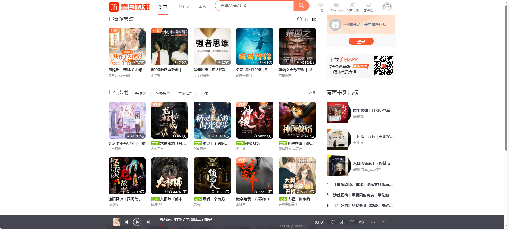

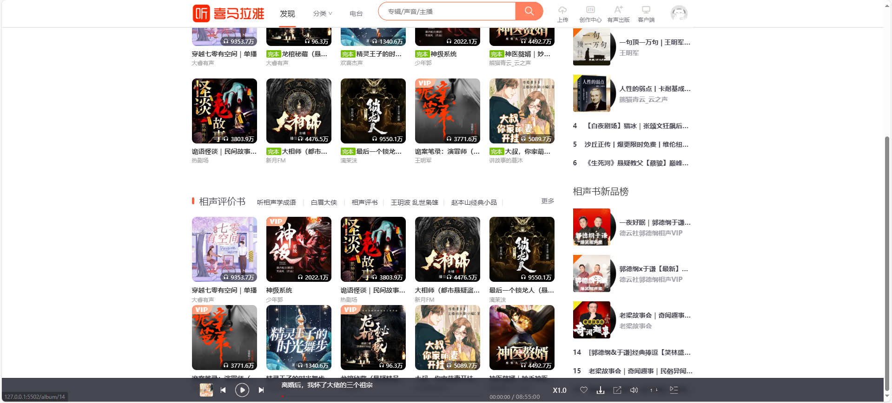


### 功能实现效果图

#### 实现鼠标滑到分类时的下拉内容：

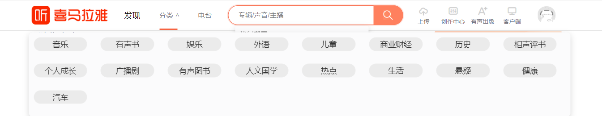

#### 点击搜索框出现文本：

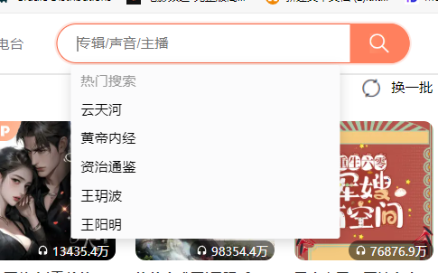 

#### 实现鼠标滑到上传、客户端、头像上的展示效果

​          

  

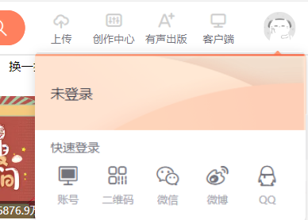 

#### 鼠标在上传的下拉栏中间的滑动效果

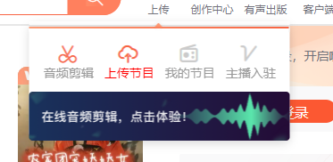


#### 点击换一批，轮流展示接口参数 tag 值为 guesslike 的 5 条


**点击后:**


#### 鼠标划到内容上的动画效果；

​               

#### 有声书这里，默认高亮第一个，点击其他分类时用接口提供的数据替换下面的内容即可（类似 Tab 切换），刷新时保持当前点击的状态；


#### 快速登录部分：

 

#### 新品榜单部分：

 

### 音乐播放器实现：

#### 播放暂停切换

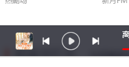


#### 上一首下一首切换

#### 点击进度条调整音乐时间

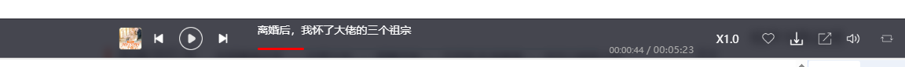

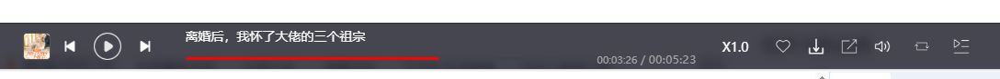

#### 音量大小调整

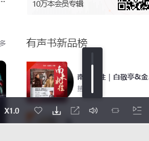

#### 音乐列表（跟随guesslike变换）


#### 列表展示：(可点击列表切换音乐)：

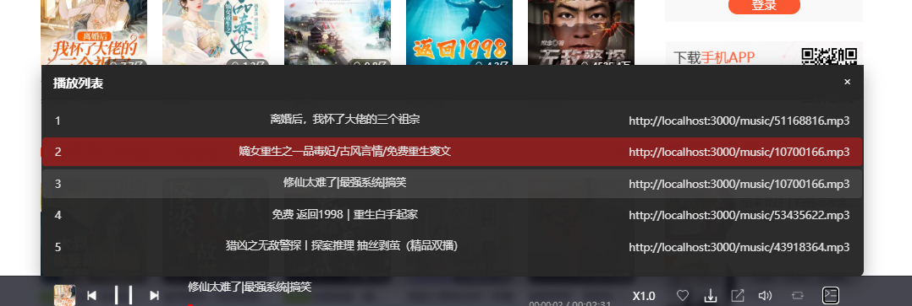


#### 倍速控制

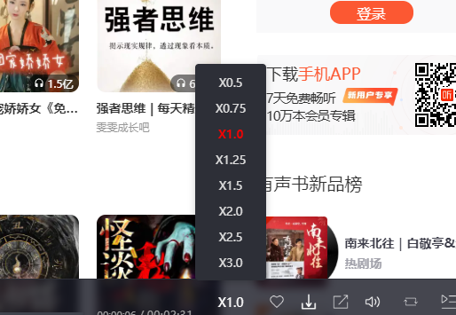


## 详细设计

### 头部功能解析

#### 滑动栏的滑动效果

* 思路：在鼠标滑动到标签的时候，下划线根据鼠标位置滑动到对应位置

* 实现：
  * 采用`getBoundingClientRect()`实时计算元素位置，通过容器相对定位计算精确坐标

  * 宽度减38px、左侧加19px的微调实现视觉对齐补偿，确保下划线精确贴合文字内容

  * 透明度动画替代display切换，保证过渡效果平滑
  
* 代码

  ```js
  const navItems = document.querySelectorAll('.nav-item');
     const underline = document.querySelector('.headerscroll');
    // 下划线动画逻辑
     function updateUnderline(target) {
        const { left, width } = target.getBoundingClientRect();
        const containerLeft = document.querySelector('.lheader').getBoundingClientRect().left;
        underline.style.opacity = '1';
        underline.style.width = `${width-38}px`;
        underline.style.left = `${19+left - containerLeft}px`;
     }
  ```

  

#### 分类栏目下拉效果

* 实现思路：

  鼠标移动到分类标签下 分类栏目显示

* 实现代码

  ~~~js
    navItems.forEach(item => {
        item.addEventListener('mouseenter', (e) => {
          if (!item.classList.contains('fenlei')) {
             updateUnderline(e.currentTarget);
          }
        });
        item.addEventListener('mouseleave', () => {
          if (!item.classList.contains('fenlei')) {
             if (activeNavItem) {
                updateUnderline(activeNavItem); // Keep underline on the active item
             } else if (firstNavItem) {
                updateUnderline(firstNavItem); // Default to the first item
             } else {
                underline.style.opacity = '0';
             }
          }
        });
        item.addEventListener('click', () => {
          navItems.forEach(nav => {
             nav.style.color = ''; 
             nav.style.fontSize = ''; // Reset font size for all items
          });
          item.style.color = 'black'; // Set clicked item's font color to black
          item.style.fontSize = '16px'; // Slightly increase clicked item's font size
          activeNavItem = item; // Update the active item
        });
     });
  
    // 分类菜单特殊处理
    const fenlei = document.querySelector('.fenlei');
    let menuVisible = false;
  
    fenlei.addEventListener('mouseenter', () => {
        menuVisible = true;
        updateUnderline(fenlei);
    });
  
    fenlei.addEventListener('mouseleave', (e) => {
        if (!e.relatedTarget || !e.relatedTarget.closest('.fenlei')) {
            menuVisible = false;
            if (activeNavItem) {
              updateUnderline(activeNavItem); // Keep underline on the active item
           } else if (firstNavItem) {
              updateUnderline(firstNavItem); // Default to the first item
           } else {
              underline.style.opacity = '0';
           }
        }
    });
  ~~~

* 细节点（分类旁边的小箭头要配合css使用）

  ~~~css
  .lheader .fenlei .fenlei1::after {
    content: '∨';
    color: #72727b !important;
    position: relative;
    display: inline-block;
    left: 4px;
    top: -2px;
    font-weight: 600;
    transition: transform 0.3s;
    font-size: 0.9em;
    text-align: center;
    vertical-align: middle;
    transform-origin: center;
    
  }
  
  .lheader .fenlei .fenlei1:hover::after {
    transform: rotate(180deg);
  }

#### 搜索框

* 实现思路   

  绑定鼠标事件 鼠标点击搜索框显示出来

* 实现代码

  ~~~js
  (function(){
     document.addEventListener('DOMContentLoaded', function() {
        const searchInput = document.querySelector('.sinput');
        // 测试是否拿到搜索框
        console.log(searchInput);
        const searchDropdown = document.getElementById('searchDropdown');
        // 测试是否拿到下拉菜单
        console.log(searchDropdown);
        // 点击搜索框时显示下拉菜单
        searchInput.addEventListener('click', function() {
          searchDropdown.style.opacity = '1';
          searchDropdown.style.pointerEvents = 'auto';
           // 测试下拉菜单是否显示
           console.log(searchDropdown.classList);
        });
      
        // 点击其他地方时隐藏下拉菜单
        document.addEventListener('click', function(event) {
          if (!searchInput.contains(event.target) && !searchDropdown.contains(event.target)) {
           searchDropdown.style.opacity = '0';
           searchDropdown.style.pointerEvents = 'none';
          }
        });
      });
  })()
  ~~~

  

  
### 身体部分实现思路

  ####  猜你喜欢&&有声书&&相声听书

* 实现思路

  每一个小的书籍展示样式一致，可以采用js模板字符串实现动态加载，具体的数据由函数`fetchdata()`从后端抓取,使用`fetch API`实现异步请求

  > 数据流：API → fetch → 格式化 → 模板渲染 → DOM插入
  > 交互流：用户点击 → 重排序 → 清除容器 → 渲染新项
  > 视觉流：悬浮封面 → 显示播放层 → 离开恢复
  
* 实现代码(猜你喜欢)

  * **异步数据获取**

    ~~~js
    async function fetchData(url) {
      try {
        const response = await fetch(url);
        return response.json().data; // 提取嵌套数据
      } catch {
        return []; // 故障安全设计
      }
    }
    ~~~
  
  * **智能数据预处理**
  
    ~~~js
    const correctedAudioUrl = data.audio.replace('.mpg', '.mp3');
    const playCount = data.times && data.times >= 100000000 
        ? `${(data.times/100000000).toFixed(1)}亿` 
        : data.times && data.times >= 10000 
        ? `${(data.times/10000).toFixed(1)}万`
        : data.times || '0';
    ~~~
  
  * **模块化元素创建**
  
    ~~~js
    function createAudioItem(data) {
      const item = document.createElement('li');
      item.className = 'audio-item';
      item.innerHTML = `
        <div class="album-card">
          <a class="album-cover" href="${correctedAudioUrl}">
            
            <div class="play-overlay">...</div>
            <p class="listen-count">${playCount}</p>
          </a>
          ${data.vip ? '' : ''}
        </div>
        <a class="album-title">${data.title}</a>
        <a class="album-author">${data.author}</a>`;
      return item;
    }
    ~~~
  
  * **五个数据的布局**
  
    ~~~js
    // 随机展示逻辑
    dataList.sort(() => Math.random() - 0.5).slice(0,5)
    
    // 间距动态处理
    items.forEach((item,index) => {
      if(index > 0) item.style.marginLeft = '20px'
    })
    ~~~
  
  * **鼠标滑动到标签播放按钮的交互**
  
    ~~~css
    .album-cover:hover .play-overlay {
      opacity: 1;
      transform: translateY(0);
    }
    .listen-count {
      transition: all 0.3s ease;
    }
    ~~~
  
    
  
  * **功能控制机制**
  
    ~~~js
    changeButton.addEventListener('click', () => {
      displayRandomItems(dataList, audioList)
    });
    ~~~
  
  * **组件化结构**
  
    ~~~js
    class AudioList {
      constructor(container, apiUrl) {
        this.container = container
        this.apiUrl = apiUrl
        this.init()
      }
      
      async init() {
        this.data = await fetchData(this.apiUrl)
        this.render()
      }
      
      render() { /* 渲染逻辑 */ }
    }
    ~~~
  
* 实现代码(有声书&&相声)
  
  * 结构化数据获取
  
    ~~~js 
    async function fetchData(url, selectedTagName) {
      const data1 = await response.json();
      return data1.data[selectedTagName]; // 按标签名提取嵌套数据
    ~~~
  
  * **模板化元素构建**
  
    ~~~js
    item.innerHTML = `
      ${data.finished ? '<span class="finished"></span>':''}
      <a href="/${data}/${data.id}">${data.text}</a>
      ${data.vip ? '' : ''}
    ~~~
  
  * **智能布局策略**（每行首个元素清除左边距）
  
    ~~~js
    items.forEach((item, index) => {
      item.style.marginLeft = (index % 5 === 0) ? '0px' : '20px'
    })
    ~~~
  
  * **标签切换系统**
  
    ~~~js
    tags.forEach(tag => {
      tag.addEventListener('click', async () => {
        selectedTagName = tag.className;
        displayRandomItems(await fetchData(apiUrl, selectedTagName));
      });
    });
    ~~~
  
  * **视觉交互**
  
    ~~~css
    .play-overlay {
      position: absolute;
      top: 0;
      left: 0;
      width: 100%;
      height: 100%;
      display: flex;
      align-items: center;
      justify-content: center;
      opacity: 0;
      transition: opacity 0.3s;
      background-color: rgba(0, 0, 0, 0.3);
    }
    
    .album-cover:hover .play-overlay {
      opacity: 1;
      transform: scale(1.4);
      transition: transform 0.2s ease; 
      
    }
    
    .play-overlay img {
      width: 40px;
      height: 40px;
      /* 圆角*/
      border-radius: 50%;
    }
    ~~~
  
  
  
#### 有声书新品榜

* 实现思路：这一段使用的是web-component规范的代码实现的，Shadow DOM实现样式隔离，connectedCallback实现挂载时数据加载。
  
* 实现代码：
  
  * **Web Components标准**
  
    ~~~js
    class Card extends HTMLElement {
      constructor() {
        super();
        this.attachShadow({ mode: 'open' });
        // Shadow DOM初始化
      }
    }
    window.customElements.define('my-card', Card);
    ~~~
  
  * **模板引擎机制**
  
    ~~~js
    const generatehtml = () => `...`; // 动态生成模板
    const template = document.createElement('template');
    template.innerHTML = generatehtml();
    ~~~
  
  * **数据动态加载**
  
    ~~~js
    connectedCallback() {
      const type = this.getAttribute('type') || 'ranking';
      this.apiUrl = `http://localhost:3000/api?tag=${type}`;
      this.fetchData(this.apiUrl);
    }
    
    async fetchData(apiUrl) {
      try {
        const response = await fetch(apiUrl);
        this.renderCards(data.data || []);
      } catch (error) {
        console.error('Error fetching data:', error);
      }
    }
    ~~~
  
  * **智能渲染**
  
    ~~~js
    renderCards(rankingData) {
      rankingData.forEach(item => {
        const card = document.createElement('li');
        if(item.img) {
          // 带图模式
        } else {
          // 文字模式
        }
      });
    }
    ~~~
  
  * **双模式布局系统**
  
    ~~~css
    /* 带图模式 */
    .youshengshu-li {
      width: 260px;
      height: 80px;
      position: relative;
    }
    
    /* 文字模式 */
    .rtitlebody1 {
      width: 260px;
      height: 20px;
    }
    ~~~
  
  * **交互视觉反馈**
  
    ~~~css
    .youshengshu-li:hover .play-overlay1 {
      opacity: 1;
      transform: scale(1.1);
    }
    
    .youshengshu-li:hover .title {
      color:red;
    }
    ~~~
  
### 音乐播放器

* 实现思路：

  > 1. **Web Components标准化**
  >
  > - 采用Shadow DOM封装实现样式隔离（`attachShadow({mode:open})`）
  >
  > - 通过Custom Elements规范注册组件（`customElements.define()`）
  >
  > - 内置属性监听机制（`observedAttributes` + `attributeChangedCallback`）
  >
  >2. **模块化状态管理**
  >
  > - 播放模式状态机（sequence/loop/random）
  >
  > - 双重播放列表设计（原始列表 + 随机列表）
  > - 独立音量/语速控制状态存储

* 核心实现代码：

  * **多模式播放控制**
  
    ~~~js
    playModes: ['sequence', 'loop', 'random']
    ~~~
  
  * 构造器实现
  
    ~~~js
    constructor() {
        super();
        this.attachShadow({ mode: 'open' });
        this.isPlaying = false;
        this.currentModeIndex = 0;
        this.currentVolume = 1;
        this.playbackRates = [0.5, 0.75, 1.0, 1.25, 1.5, 2.0, 2.5, 3.0];
        this.currentRateIndex = 2;
        this.currentTime = 0;
        this.volume = 1;
    
    
        this.playlist = [];          // 原始播放列表
        this.shuffledPlaylist = [];  // 随机播放列表
        this.currentTrackIndex = -1; // 当前播放索引
        this.playModes = ['sequence', 'loop', 'random'];
        this.currentMode = 0;        // 0-顺序 1-单曲循环 2-随机
    }   
    ~~~
  
  * 播放控制
  
    ~~~js
    _bindEvents() {
        // 播放控制
        this.elements.playBtn.addEventListener('click', () => {this.togglePlay();
          // this.elements.playBtn.classList.toggle('is-playing');
          this._setPlayState(false); // 同步状态
        });
        
    
        // 上一首下一首
        this.elements.prevBtn.addEventListener('click', () => this.playPrev());
        this.elements.nextBtn.addEventListener('click', () => this.playNext());
    
    
        // 倍速控制
        this.elements.speedBtn.addEventListener('click', (e) => this.handleSpeedBtnClick(e));
        this.elements.speedOptions.forEach(option => {
          option.addEventListener('click', (e) => this.handleSpeedOptionClick(e));
        });
    
        // 进度条控制
        this.elements.progressBar.addEventListener('click', (e) => this.handleProgressBarClick(e));
    
        // 随机播放模式
        this.elements.shuffleBtn.addEventListener('click', () => this.togglePlayMode());
        this.elements.shuffleBtn.addEventListener('mouseenter', () => this.handleShuffleHover());
        this.elements.shuffleBtn.addEventListener('mouseleave', () => this.handleShuffleLeave());
    
        // 音量控制
        this.elements.volumeBtn.addEventListener('click', (e) => this.handleVolumeBtnClick(e));
        this.elements.volumeMenu.querySelector('.volume-slider').addEventListener('mousedown', (e) => this.startVolumeDrag(e));
        document.addEventListener('mouseup', () => this.endVolumeDrag());
        document.addEventListener('mousemove', (e) => this.handleVolumeDrag(e));
        document.addEventListener('click', () => this.closeMenus());
        // 列表控制
        this.elements.playlistBtn.addEventListener('click', (e) =>{
          e.stopPropagation();
          this.elements.playlistContainer.style.opacity = '1';
          // this.togglePlaylist();
          this._renderPlaylistItems();
        });
        console.log(this.elements.closeBtn);
        this.elements.closeBtn.addEventListener('click', (e) => {
          e.stopPropagation();
          this.elements.playlistContainer.style.opacity = '0'});
    
        // 优化外部点击判断
        this._clickOutsideHandler = (e) => {
          e.stopPropagation();
            if (!this.elements.playlistContainer.contains(e.target))
                  this.elements.playlistContainer.style.opacity = '0';
            };
      }
    
    ~~~
  
    
  
  

​    

## 亮点

* 使用自定义Web组件`<my-card type="ranking">`实现排行榜模板复用，提高可维护性（有声书+相声书）采用差异化模板渲染

  ~~~html
    <div class="new-youshengshu">
            <div class="youshengshutitle">
              相声书新品榜
            </div>
            <my-card type="ranking1"></my-card>
          </div>
        </div>
  ~~~

  ~~~js
     <div class="new-youshengshu">
            <div class="youshengshutitle">
              有声书新品榜
            </div>
            <my-card type="ranking"></my-card>
  ~~~

* 音乐播放器组件化实现，使用模板字符串实现 生命周期单独控制

  ~~~html
  <music-player  volume="0.8" style="width: 80%; margin: 20px auto;">
      </music-player>
  ~~~

* 通过`guesslike.js`/`listenbook.js`等脚本实现功能模块化加载

  ~~~html
    function createAudioItem(data) {
      const item = document.createElement('li');
      item.className = 'listenbook-body-item';
      const finishedClass = data.finished ? 'true' : 'false';
      // console.log('Data:', data.finished); // 打印数据内容
      // 格式化播放次数
      const playCount = data.times && data.times >= 100000000 
      ? `${(data.times/100000000).toFixed(1)}亿` 
      : data.times && data.times >= 10000 
      ? `${(data.times/10000).toFixed(1)}万`
      : data.times || '0';
      
      item.innerHTML = `
        <div class="album-wrapper">
          <div class="album-card">
            <a class="album-cover" href="/album/${data.id}">
              
              <div class="play-overlay">
                
              </div>
              <p class="listen-count">
                <i class="icon-earphone"></i>
                <span>${playCount}</span>
              </p>
            </a>
            ${data.vip ? '' : ''}
          </div>
          <div class=finisher-container>
          ${data.finished ? '<span class="finished "></span>':''}
          <a class="album-title " href="/${data}/${data.id}" title="${data.text}">
          ${data.text}
          </a>
          </div>
          <a class="album-author" href="/zhubo/${data.authorId || ''}">${data.author}</a>
        </div>
      `;
      return item;
    }
  ~~~

  

* 猜你喜欢模块实现动态换一批批机制（换一批按钮+js交互）


